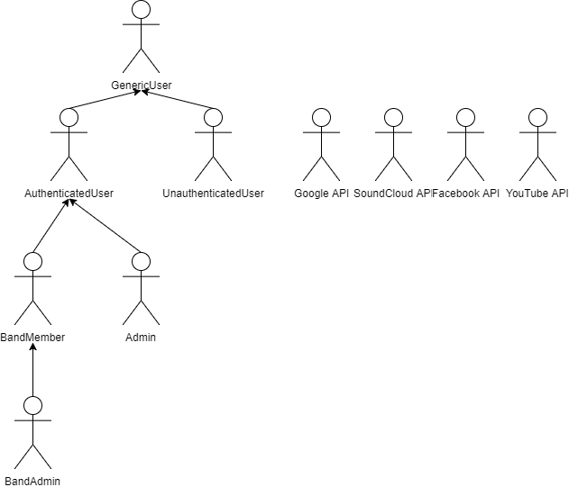

# Actors and User Stories

## Actors

## User Stories

### GenericUser
|Identifier|Name|Priority|Description|
| -------- | -- |:------:| --------- |
|US01      |About Page|medium|As a GenericUser, I want to access about page, so that I can see a complete website's description.|
|US02      |FAQ Page|medium|As a GenericUser, I want to access FAQ page, so that I can see a Frequently Asked Questions.|
|US03      |Contact Page|medium|As a GenericUser, I want to access contact page, so that I can see the website owners' contacts.|
|US04      |Terms Page|medium|As a GenericUser, I want to access terms and conditions page, so that I can see a complete list of terms and conditions imposed by the website.|

### UnauthenticatedUser
|Identifier|Name|Priority|Description|
| -------- | -- |:------:| --------- |
|US05      |Register|high|As an UnauthenticatedUser, I want to register myself into the system, so that I can login.|
|US06      |Log in|high|As an UnauthenticatedUser, I want to login into the system, so that I can access privileged information.|
|US07      |Register using external API|medium|As an UnauthenticatedUser, I want to register myself into the system using the facebook API, so that I can login.|
|US08      |Register using external API|medium|As an UnauthenticatedUser, I want to register myself into the system using the google API, so that I can login.|
|US09      |Log in using Facebook API|medium|As an UnauthenticatedUser, I want to login into the system using the facebook API, so that I can access privileged information.|
|US10      |Log in using Google API|medium|As an UnauthenticatedUser, I want to login into the system using the google API, so that I can access privileged information.|

### AuthenticatedUser
|Identifier|Name|Priority|Description|
| -------- | -- |:------:| --------- |
|US11      |Profile Page|high|As an AuthenticatedUser, I want to access my Profile Page and change my information, so that it stays up to date.|
|US12      |Notifications List|high|As an AuthenticatedUser, I want to access my Notifications List, so that I can see my notifications.|
|US13      |Feed Page|high|As an AuthenticatedUser, I want to access the Feed Page, so that I can see posts from the users/bands I follow. This is the homepage of an authenticated user|
|US14      |Follow Users|high|As an AuthenticatedUser, I want to follow other users, so that I can see their posts on my feed page.|
|US15      |Unfollow Users|high|As an AuthenticatedUser, I want to unfollow other users, so that I no longer see their posts on my feed page.|
|US16      |Follow Bands|high|As an AuthenticatedUser, I want to follow bands, so that I can see their posts on my feed page.|
|US17      |Unfollow Bands|high|As an AuthenticatedUser, I want to unfollow bands, so that I no longer see their posts on my feed page.|
|US18      |Create Band Page|high|As an AuthenticatedUser, I want to create bands' pages, so that I can share my band with other people.|
|US19      |Post|high|As an AuthenticatedUser, I want to post on the system, so that I can share content.|
|US20      |Search for users/bands|high|As an AuthenticatedUser, I want to search for user/bands using their names, description or genre, so that I can find users and bands.|
|US21      |Profile Page|high|As an AuthenticatedUser, I want to access other users' profile pages, so that I can see their information and posts.|
|US22      |Band Page|high|As an AuthenticatedUser, I want to access bands' pages, so that I can see their information and posts.|
|US23      |Comment|medium|As an AuthenticatedUser, I want to comment on posts, so that I can share my opinion.|
|US24      |Report bands'|medium|As an AuthenticatedUser, I want to report bands' behaviour, so that negative bands or negative content gets removed from the system.|
|US25      |Report users'|medium|As an AuthenticatedUser, I want to report other users' behaviour, so that negative users or negative content gets removed from the system.|
|US26      |Rate bands|medium|As an AuthenticatedUser, I want to rate other bands, so that I can evaluate their quality.|
|US27      |Rate users|medium|As an AuthenticatedUser, I want to rate other users, so that I can evaluate their quality.|
|US28      |Apply to Bands|low|As an AuthenticatedUser, I want to apply to bands, so I can join a band looking for a musician.|
|US29      |Chat|low|As an AuthenticatedUser, I want to chat with other users, so that I can keep contact with them.|
|US30      |Remove own comments|low|As an AuthenticatedUser, I want to remove my comments from the system, so that I can remove unnecessary comments.|
|US31      |Remove own posts|low|As an AuthenticatedUser, I want to remove my posts from the system, so that I can remove unnecessary posts.|
|US32      |Post using Soundcloud API|low|As an AuthenticatedUser, I want to post songs on the system using the soundcloud API, so that I can share content from soundcloud.|
|US33      |Post using Youtube API|low|As an AuthenticatedUser, I want to post songs on the system using the youtube API, so that I can share content from youtube.|

### Admin
|Identifier|Name|Priority|Description|
| -------- | -- |:------:| --------- |
|US34      |Access reported content|high|As an Admin, I want to access reported content, so that I can see and notify the responsible user.|
|US35      |Create music genre|high|As an Admin, I want to add music genres, so that bands can have music genres registered.|
|US36      |Remove comments|high|As an Admin, I want to remove comments, so that I can remove inappropriate/offensive comments.|
|US37      |Remove posts|high|As an Admin, I want to remove posts, so that I can remove inappropriate/offensive posts.|
|US38      |Ban user|high|As an Admin, I want to remove a user from the system, so that I can remove users with negative behaviour.|
|US39      |Ban band|high|As an Admin, I want to remove a band from the system, so that I can remove bands with negative behaviour.|
|US40      |Give/Take privileges|low|As an Admin, I want to give or take other users Admin privileges, so that they can help me keep the system safer and cleaner.|
|US41      |Notify user|low|As an Admin, I want to warn a user, so that I can warn off users about their negative behaviour so they change it.|
|US42      |Notify band|low|As an Admin, I want to warn a band, so that I can warn off bands with negative behaviour in order to change it.|

### Band Member
|Identifier|Name|Priority|Description|
| -------- | -- |:------:| --------- |
|US43      |Band page|high|As a Band Member, I want to access the band's page, so that I can see what has been posted privately.|
|US44      |Band chat|medium|As a Band Member, I want to chat with other band's members, so that we can talk privately on the system.|

### Band Admin
|Identifier|Name|Priority|Description|
| -------- | -- |:------:| --------- |
|US45      |Recruit users|high|As a Band Admin, I want to recruit users to the band, so that they can be band members.|
|US46      |Remove users|high|As a Band Admin, I want to remove users from the band, so that they no longer are band members.|
|US47      |Schedule Concerts|high|As a Band Admin, I want to schedule concerts, so that the band followers know where and when to attend our concerts.|
|US48      |Post|high|As a Band Admin, I want to post on the band's page either publicly or privately, so that I can keep it updated.|
|US49      |Post|high|As a Band Admin, I want to create events on the band's page either publicly or privately, so that the followers or band members can see.|
|US50      |Remove posts|high|As a Band Admin, I want to remove posts from the band's page, so that I can remove unnecessary posts.|

## Annex: Supplementary Requirements

This annex contains business rules, technical requirements and other non-functional requirements on the project.

### Business Rules
|Identifier|Name|Description|
| -------- | -- | --------- |
|BR01      |Add/remove members to band|Only a band admin can add/remove members from the band.|
|BR02      |Give/Take privileges|Only an admin can give/take other users admin privileges.|
|BR03

### Technical Requirements
|Identifier|Name|Description|
| -------- | -- | --------- |
|TR01      |Availability|The system must be available 99 percent of the time in each 24-hour period.|
|TR02      |Accessibility|The system must ensure that everyone can access the pages, regardless of whether they have any handicap or not, or the Web browser they use.|
|TR03      |Usability|The system should be simple and easy to use.|
|TR04      |Performance|The system should have response times shorter than 2s to ensure the user's attention.|
|TR05      |Web application	|The system should be implemented as a Web application with dynamic pages (HTML5, JavaScript, CSS3 and PHP).|
|TR06      |Portability|The server-side system should work across multiple platforms (Linux, Mac OS, etc.).|
|TR07      |Database|The PostgreSQL 9.4 database management system must be used.|
|TR08      |Security|The system shall protect information from unauthorised access through the use of an authentication and verification system.|
|TR09      |Robustness|The system must be prepared to handle and continue operating when runtime errors occur.|
|TR10      |Scalability|The system must be prepared to deal with the growth in the number of users and their actions.|
|TR11      |Ethics|The system must respect the ethical principles in software development (for example, the password must be stored encrypted to ensure that only the owner knows it).|

### Restrictions
|Identifier|Name|Description|
| -------- | -- | --------- |
|C01       |Deadline|The system should be ready to be used in 28/05/2018.|

## Revision history

> Revision 1
 * Added user stories and redefined priorities
 * Ordered user stories by priority
 * Added business rules, technical requirements and restrictions

***

GROUP1712, 10/09/2018

> João Pinheiro, up201104913@fe.up.pt

> Leonardo Teixeira, up201502848@fe.up.pt

> Danny Soares, up201505509@fe.up.pt

> João Azevedo, up201503256@fe.up.pt
