# A3: User Interface Prototype

## 1. Interface and common features
 
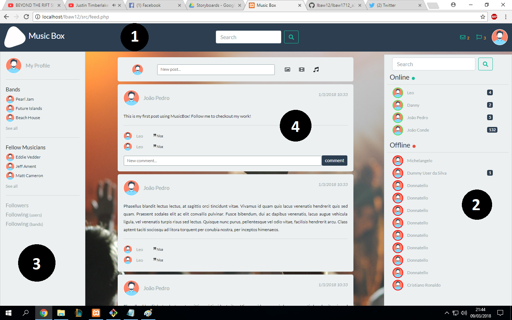
*Figure 1 - Main interface*

> The image above shows the main interface of the website, for an authenticated user, which is the feed page, from where the user can access everything he has permission to.
>
>The tag "1" is located on the header of the website, a navbar with the logo, a search bar, one dropdown for the messages and another one for the notifications, and, finally, a picture of the user, to access his profile or logout.
>
>The tag "2" points to the website chat, where users can trade messages with other users.
>
>The tag "3" is on a sidebar, where users have links to their bands, followers and people who they follow.
>
>The tag "4" is right on the feed section, where users can see posts from the users and bands they follow.
>
>We developed everything so that the website has an appealing interface either on a big screen (computer), a medium screen (tablet) or on a small one (phone).

## 2. Sitemap

> The next image shows the sitemap of the website, representing the hierarchy of the pages and the relations between them, giving the team a better knowledge to build the website.

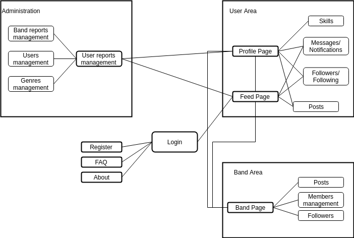

*Figure 2 - Sitemap*

## 3. Storyboards

### Make a post

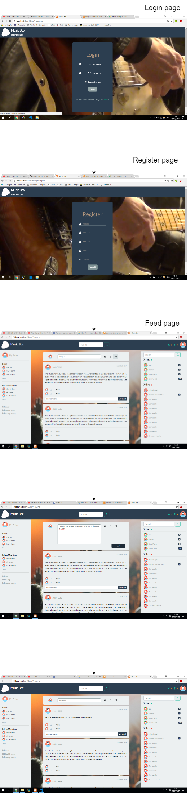

*Figure 3* [Making a post](https://joaopedrofump.github.io/lbaw12/feed.php)

### Unfollowing an user

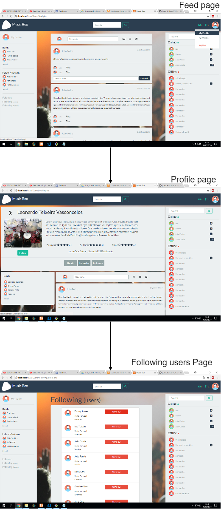

*Figure 4* [Unfollow an user](https://joaopedrofump.github.io/lbaw12/index.html)

### Make a search

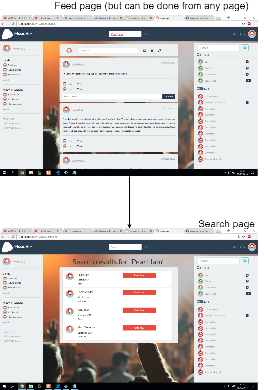

*Figure 5* [Search](https://joaopedrofump.github.io/lbaw12/index.html)

### Administrate the social network - ban an user, warn a band, add a genre and promote an user to admin

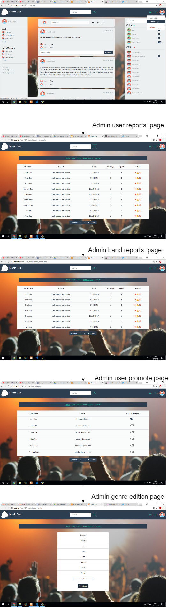

*Figure 6* [Admin powers](https://joaopedrofump.github.io/lbaw12/index.html)

## 4. Interfaces

### UI01: Home/Login

*Figure 7* [Home](https://joaopedrofump.github.io/lbaw12/index.html)
### UI02: About
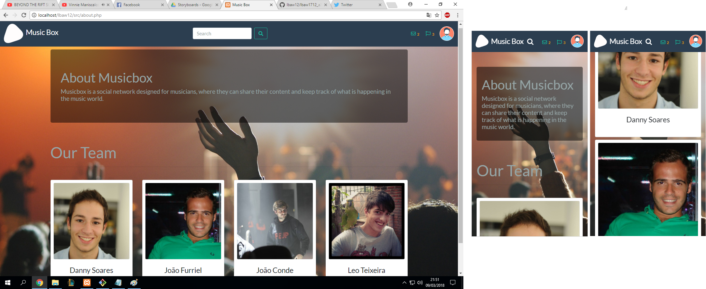
*Figure 8* [About](https://joaopedrofump.github.io/lbaw12/about.html)
### UI03: FAQ
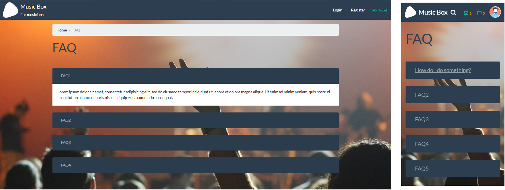
*Figure 9* [FAQ](https://joaopedrofump.github.io/lbaw12/faqs.html)
### UI04: Register
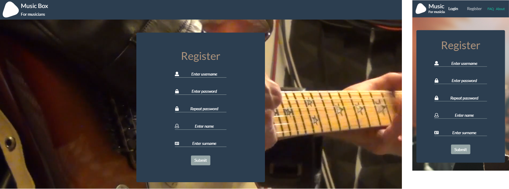
*Figure 10* [Register](https://joaopedrofump.github.io/lbaw12/register.html)
### UI05: Feed
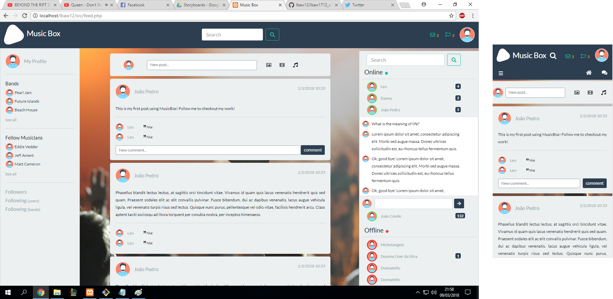
*Figure 11* [Feed](https://joaopedrofump.github.io/lbaw12/feed_jp.html)
### UI06: Profile
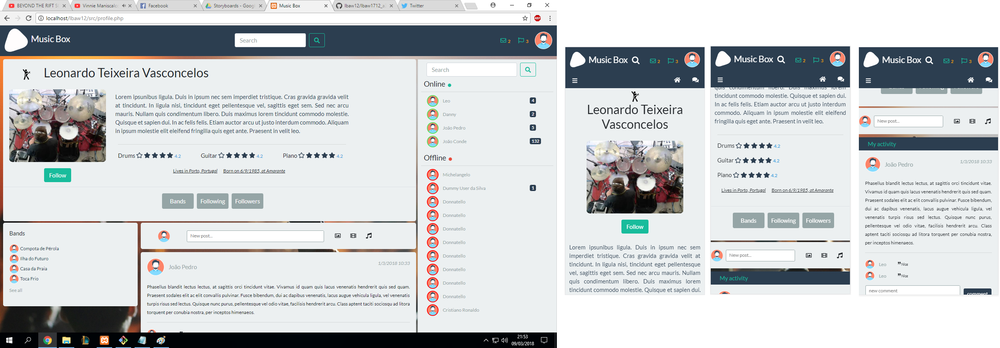
*Figure 12* [Profile](https://joaopedrofump.github.io/lbaw12/profile.html)
### UI07: Admin Users tab
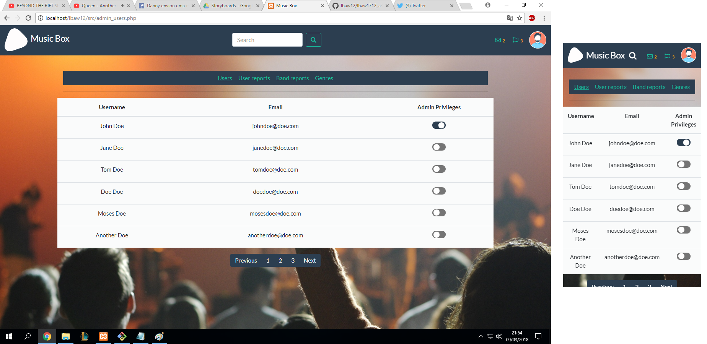
*Figure 14* [Admin Users](https://joaopedrofump.github.io/lbaw12/admin_users.html)
### UI09: Admin User Reports tab
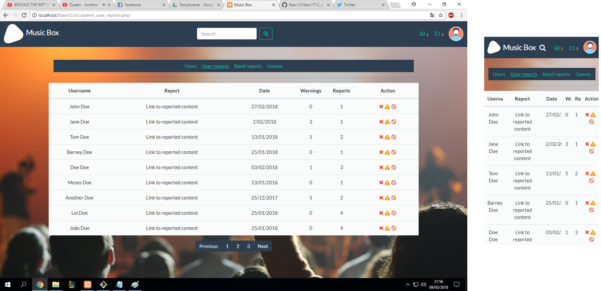
*Figure 15* [Admin Reports](https://joaopedrofump.github.io/lbaw12/admin_reports.html)
### UI09: Admin Band Reports tab
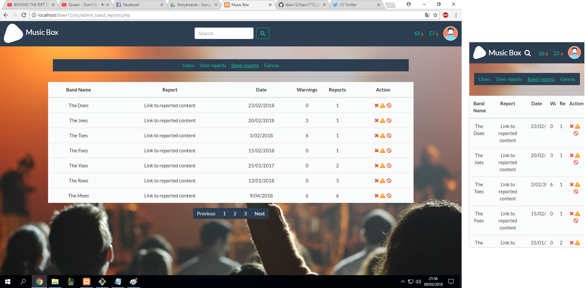
*Figure 15* [Admin Reports](https://joaopedrofump.github.io/lbaw12/admin_reports.html)
### UI10: Admin Genres tab
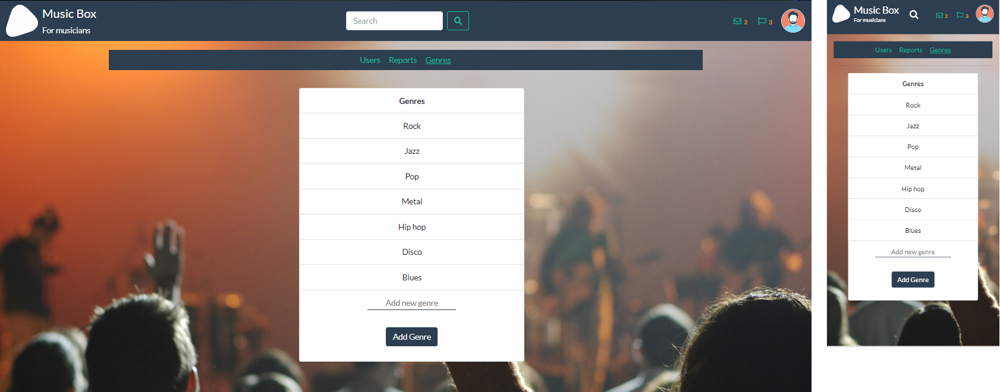
*Figure 16* [Admin Genres](https://joaopedrofump.github.io/lbaw12/admin_genres.html)

## Revision history

GROUP1712, 09/03/2018

> João Pinheiro, up201104913@fe.up.pt

> Leonardo Teixeira, up201502848@fe.up.pt

> Danny Soares, up201505509@fe.up.pt

> João Azevedo, up201503256@fe.up.pt
