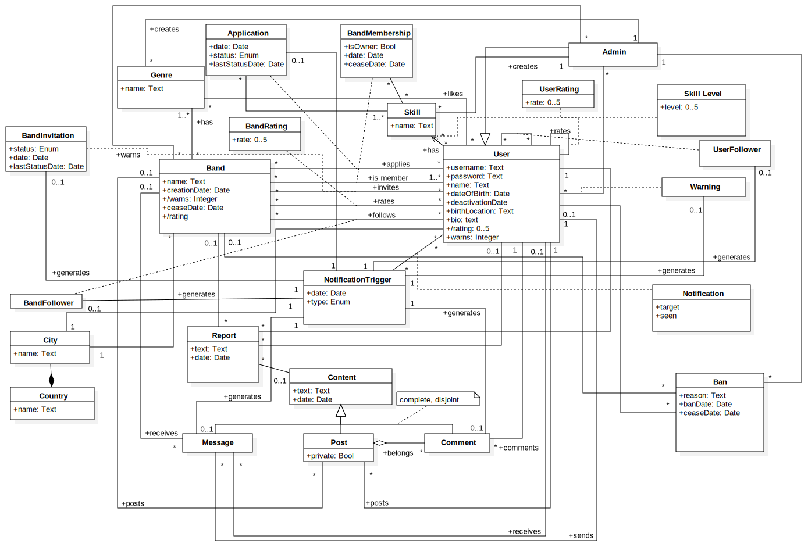

# Conceptual Data Model

## 1. Class Diagram

| System Constraints||
| ---|---|
| User               | username NOT NULL UNIQUE   password NOT NULL   name NOT NULL   date of birth < today   location NOT NULL |
| Band               | name NOT NULL UNIQUE   creation date DEFAULT today |
| Content            | date DEFAULT today   text NOT NULL |
| Post               | If post has a band, user who posts has to be member of the band   private NOT NULL |
| Ban                | Only one ban without cease date   Ban → (User ⊕ Band) |
| NotificationTrigger| type {warning, comment, follow, band invitation, application, message}   NotificationTrigger (generated by) → (UserFollower ⊕ BandFollower ⊕ Message ⊕ Comment ⊕ Application ⊕ Invitation ⊕ Warning) |
| Message            | if message has a band, sender has to be member of the band   Message (received by) → (User ⊕ Band) |
| Report             | text NOT NULL   date DEFAULT today   Report → (Content ⊕ User ⊕ Band)|
| Country            | name NOT NULL |
| City               | name NOT NULL |
| BandInvitation     | status {pending, accepted, rejected, cancelled} |
| Genre              | name NOT NULL UNIQUE |
| Skill              | name NOT NULL UNIQUE |
| Application        | status: {canceled, pending, accepted, rejected}   date DEFAULT today |
| BandMembership     | date DEFAULT today   isOwner NOT NULL |

## 2. Aditional Business Rules

| Business Rules                                                                           |
| ---------------------------------------------------------------------------------------- |
| If the message is sent on behalf of the band, the sender has to be a member of the band. |
| If content is posted on behalf of the band, the poster has to be a member of the band.   |

## Revision history

> Revision 1
 * Updated UML diagram:
    * Notification structure;
    * Admin - User structure;
    * Minor modifications;
 * Contrains removed from UML Diagram and displayed in a table after it;
***

GROUP1712, 12/03/2018

> João Pinheiro, up201104913@fe.up.pt

> Leonardo Teixeira, up201502848@fe.up.pt

> Danny Soares, up201505509@fe.up.pt

> João Azevedo, up201503256@fe.up.pt